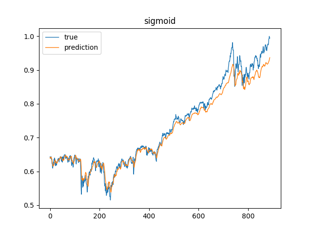

# 基于多层感知机(MLP)的时间序列预测

### 数据集

sp500.csv文件包含2000年1月至2018年9月标准普尔500股票指数的开盘价，最高价，最低价，收盘价以及每日交易量。我们针对收盘价(CLOSE)进行预测。

数据集被划分为不相交的训练集和测试集，比例为8：2，训练集包含3758条数据，测试集包含939条数据。

### 测试结果(未归一化)

##### 1. 激活函数为identity(即不做任何变换)

在测试集上误差为511.35363739810424。

蓝色为真实数值，橙色为预测数值，下同。

##### 2. 激活函数为relu

在测试集上平方误差为473.7846261077212。

### 测试结果(归一化)

##### 1. 激活函数为identity

MSE = 7.924837909786295E-5

##### 2. 激活函数为relu

MSE = 3.744622215025918E-4

##### 3. 激活函数为sigmoid

MSE = 5.16028372248536E-4

##### 4. 激活函数为tanh

MSE = 3.159136011043228E-4

